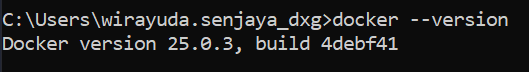
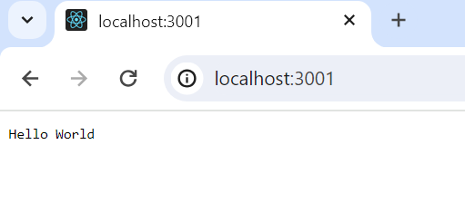
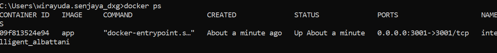

# Revou Mini Project Docker

## Install Docker
1. Install [Docker Desktop](https://docs.docker.com/desktop/install/windows-install/)
2. Jalankan Docker Desktop
3. Untuk mengecek jika Docker terinstall, buka *command prompt* dan jalankan *command* `docker --version`

## Cara menjalankan image di Docker
1. Buat *image* pada file `dockerfile`
2. Jalankan Docker Desktop
3. Build *image* dengan menggunakan *command* `docker build -t app .`
4. Jalankan image pada *container* dengan *command* `docker run -d -p 3001:3001 app`
5. Akses ke port 3001 untuk mengecek jika *container* sudah berjalan atau belum
6. Jalankan *command* `docker ps` untuk mengecek *container* yang sedang berjalan

